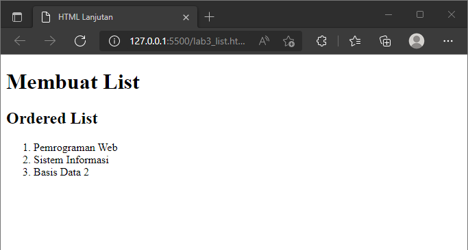
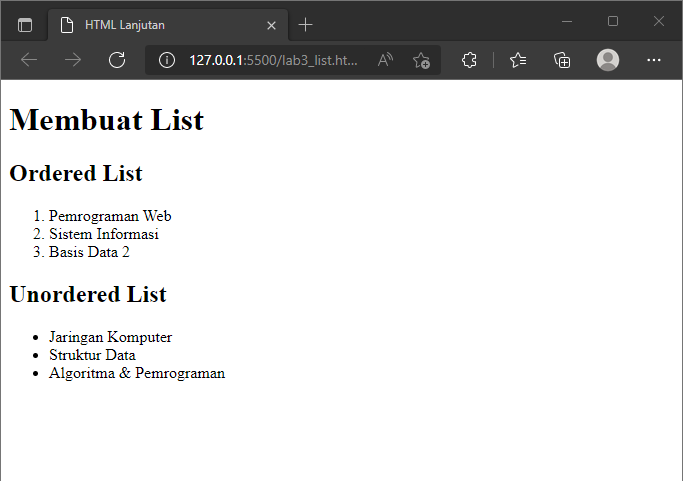
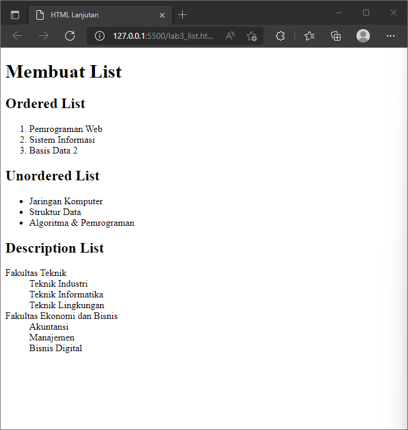
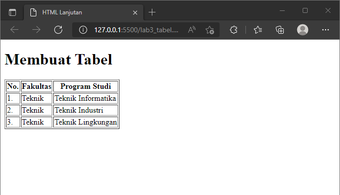
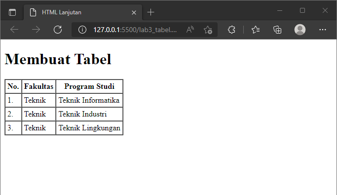
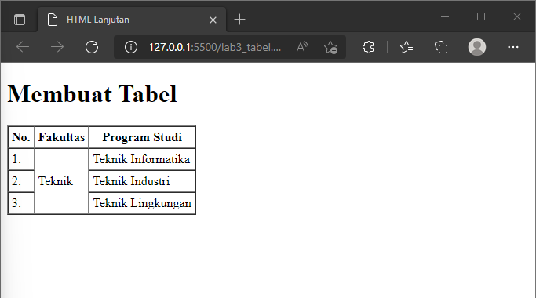
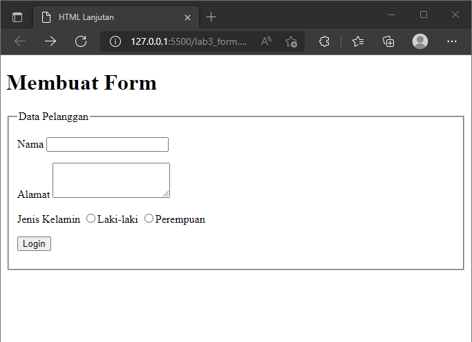
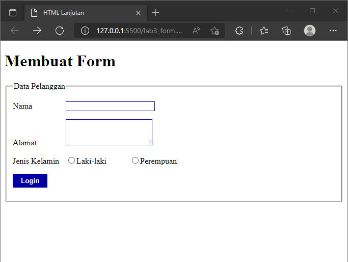
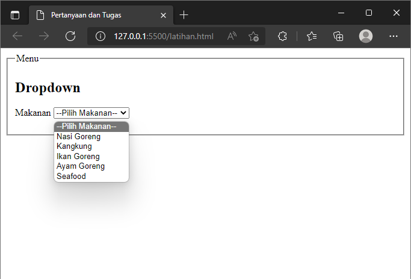
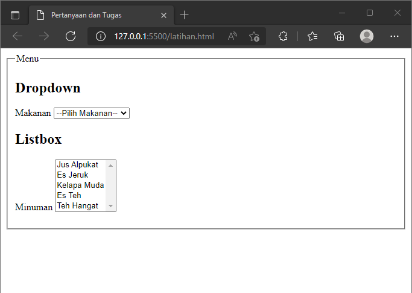

# Praktikum 3

## Profil
| | Biodata |
| -------- | --- |
| **Nama** | Humam Fathurrahman |
| **NIM** | 312010389 |
| **Kelas** | TI.20.A2 |
| **Mata Kuliah** | Pemrograman Web |

## 1. Membuat dokumen HTML

Membuat dokumen HTML dengan nama file **lab3_list.html** seperti berikut.

```html
<!DOCTYPE html>
<html lang="en">
<head>
    <meta charset="UTF-8">
    <meta http-equiv="X-UA-Compatible" content="IE=edge">
    <meta name="viewport" content="width=device-width, initial-scale=1.0">
    <title>HTML Lanjutan</title>
</head>
<body>
    <header>
        <h1>Membuat List</h1>
    </header>
</body>
</html>
```

## 2. Membuat Ordered List

Kemudian tambahkan kode untuk membuat *Ordered List* seperti berikut.

```html
<section id="order-list">
    <h2>Ordered List</h2>
    <ol>
        <li>Pemrograman Web</li>
        <li>Sistem Informasi</li>
        <li>Basis Data 2</li>
    </ol>
</section> 
```

Makan hasilnya seperti berikut.



## 3. Membuat Unordered List

Kemudian tambahkan kode untuk *Unordered List*, setelah deklarasi ordered list pada section ```unordered-list```, seperti berikut.

```html
<section id="unorder-list">
    <h2>Unordered List</h2>
    <ul>
        <li>Jaringan Komputer</li>
        <li>Struktur Data</li>
        <li>Algoritma & Pemrograman</li>
    </ul>
</section>
```

Maka hasilnya seperti berikut. 



## 4. Membuat Description List

Tambahkan kode untuk membuat *description list* setelah deklarasi *unordered-list*

```html
<section id="unorder-list">
    <h2>Description List</h2>
    <dl>
        <dt>Fakultas Teknik</dt>
        <dd>Teknik Industri</dd>
        <dd>Teknik Informatika</dd>
        <dd>Teknik Lingkungan</dd>
        <dt>Fakultas Ekonomi dan Bisnis</dt>
        <dd>Akuntansi</dd>
        <dd>Manajemen</dd>
        <dd>Bisnis Digital</dd>
    </dl>
</section>
```

Maka hasilnya seperti berikut.



## 5. Membuat Tabel

Buat file  baru dengan nama **lab3_tabel.html** seperti berikut.

```html
<!DOCTYPE html>
<html lang="en">
<head>
    <meta charset="UTF-8">
    <meta http-equiv="X-UA-Compatible" content="IE=edge">
    <meta name="viewport" content="width=device-width, initial-scale=1.0">
    <title>HTML Lanjutan</title>
</head>
<body>
    <header>
        <h1>Membuat Tabel</h1>
    </header>
</body>
</html>
```

Selanjutnya tambahkan kode untuk membuat tabel sederhana seperti berikut.

```html
<table border="1">
    <thead>
        <tr>
            <th>No.</th>
            <th>Fakultas</th>
            <th>Program Studi</th>
        </tr>
    </thead>
    <tbody>
        <tr>
            <td>1.</td>
            <td>Teknik</td>
            <td>Teknik Informatika</td>
        </tr>
        <tr>
            <td>2.</td>
            <td>Teknik</td>
            <td>Teknik Industri</td>
        </tr>
        <tr>
            <td>3.</td>
            <td>Teknik</td>
            <td>Teknik Lingkungan</td>
        </tr>
    </tbody>
</table>
```

Maka hasilnya seperti berikut.



### **Mengatur Margin dan Padding**

Untuk mengatur margin dan padding pada cell data, tambahkan atribut ```cellpadding``` dan ```cellspacing``` pada tag table.

```html
<table border="1" cellpadding="4" cellspacing="0">
```

Maka hasilnya seperti berikut.



## 6. Menggabungkan Cell Data

Untuk menggabungkan cell data, gunakan atribut rowspan dan colspan. Atribut rowspan untuk menggabungkan baris (secara vertikal) dan colspan untuk menggabungkan kolom (secara horizontal)

```html
<table border="1" cellpadding="4" cellspacing="0">
    <thead>
        <tr>
            <th>No.</th>
            <th>Fakultas</th>
            <th>Program Studi</th>
        </tr>
    </thead>
    <tbody>
        <tr>
            <td>1.</td>
            <td>Teknik</td>
            <td>Teknik Informatika</td>
        </tr>
        <tr>
            <td>2.</td>
            <td>Teknik Industri</td>
        </tr>
        <tr>
            <td>3.</td>
            <td>Teknik Lingkungan</td>
        </tr>
    </tbody>
</table>
```

Maka hasilnya seperti berikut.



## 7. Membuat Form

Buat file dengan nama **lab3_form.html** seperti berikut.

```html
<!DOCTYPE html>
<html lang="en">
<head>
    <meta charset="UTF-8">
    <meta http-equiv="X-UA-Compatible" content="IE=edge">
    <meta name="viewport" content="width=device-width, initial-scale=1.0">
    <title>HTML Lanjutan</title>
</head>
<body>
    <header>
        <h1>Membuat Form</h1>
    </header>
</body>
</html>
```

Selanjutnya tambahkan kode untuk membuat form sederhana seperti berikut.

```html
<form action="proses.php" method="post">
    <fieldset>
        <legend>Data Pelanggan</legend>
        <p>
            <label for="nama">Nama</label>
            <input type="text" id="nama" name="nama">
        </p>
        <p>
            <label for="alamat">Alamat</label>
            <textarea id="alamat" name="alamat" cols="20" rows="3"></textarea>
        </p>
        <p>
            <label>Jenis Kelamin</label>
            <input id="jk_l" type="radio" name="kelamin" value="L"><label for="jk_l">Laki-laki</label>
            <input id="jk_p" type="radio" name="kelamin" value="P"><label for="jk_p">Perempuan</label>
        </p>
        <p><input type="submit" value="Login"></p>
    </fieldset>
</form>
```

Maka hasilnya seperti berikut.



### **Menambahkna Style pada Form**

Supaya tampilan lebih menarik, bisa ditambahkan CSS seperti berikut.

```css
<style>
    form p > label {
        display: inline-block;
        width: 100px;
    }
    form input[type="text"], form textarea{
        border: 1px solid #0300a3;
    }
    form input[type="submit"]{
        border: 1px solid #0300a3;
        background-color: #0300a3;
        color: #ffffff;
        font-weight: bold;
        padding: 5px 15px;
    } 
</style>
```

Maka hasilnya seperti berikut.



## Pertanyaan dan Tugas
### 1. Buatlah form yang menampilkan ***dropdown*** menu dan ***listbox*** dengan multiple selection.

### jawab

Pertama membuat file dengan nama **latihan.html**

Dibawah ini membuat form dengan menampilkan ***Dropdown*** menu, dengan menggunakan tag **Select** dan **Option** sebagai opsi untuk memilih, contohnya membuat opsi untuk memilih menu makanan.



dengan code seperti berikut.

```html
<!DOCTYPE html>
<html lang="en">
<head>
    <meta charset="UTF-8">
    <meta http-equiv="X-UA-Compatible" content="IE=edge">
    <meta name="viewport" content="width=device-width, initial-scale=1.0">
    <title>Pertanyaan dan Tugas</title>
</head>
<body>
    <form action="">
        <fieldset>
            <legend>Menu</legend>
            <p>
                <h2>Dropdown</h2>
                <label for="Makanan">Makanan</label>
                <select name="Makanan" id="Makanan">
                    <option value="" selected="selected">--Pilih Makanan--</option>
                    <option value="Nasi Goreng">Nasi Goreng</option>
                    <option value="Kangkung">Kangkung</option>
                    <option value="Ikan Goreng">Ikan Goreng</option>
                    <option value="Ayam Goreng">Ayam Goreng</option>
                    <option value="Seafood">Seafood</option>
                </select>
            </p>
        </fieldset>
    </form>
</body>
</html>
```

Dibawah ini ***Listbox*** dengan multiple selection atau bisa memilih lebih dari satu.



dengan code seperti berikut.

```html
<p>
    <h2>Listbox</h2>
    <label for="Minuman" >Minuman</label>
    <select name="Minuman" id="Minuman" multiple size="5">
        <option value="Jus Alpukat">Jus Alpukat</option>
        <option value="Es Jeruk">Es Jeruk</option>
        <option value="Kelapa Muda">Kelapa Muda</option>
        <option value="Es Teh">Es Teh</option>
        <option value="Teh Hangat">Teh Hangat</option>
    </select>
</p>
```